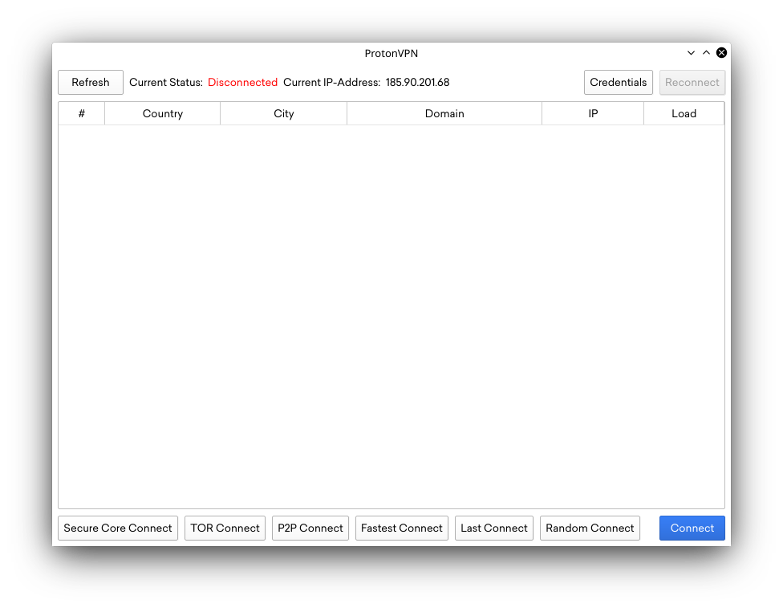

# Protonvpn-GUI
A GUI for protonvpn-cli written with QT. Designed for Linux.

*Work in progress.*

## Installation

### Linux

#### Arch Linux

AUR package planned.

#### Other distros:

##### Dependencies

- **QT5** Not sure which version, latest version tested: 5.13.0
- **protonvpn-cli** => 1.1.2
- **pkexec**

##### Building

1.

### ~~Mac~~

~~Theoretically, this program works on MacOS, but it's never been tested, proceed at your own risk. The building instructions should be the same as in Linux.~~  
If you have the patience for it, forking and editing this program to work on MacOS shouldn't be hard.

## Usage

## To-Do
- [ ] Everything
